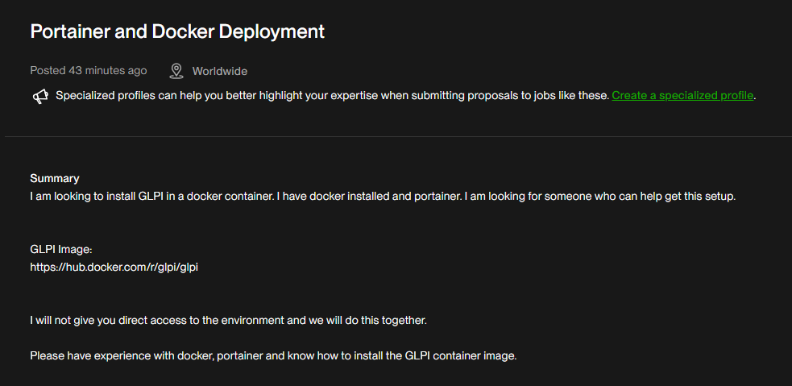

# GLPI Deployment with Docker & Portainer



**Summary:**
This document described how GLPI was deployed as Docker containers and managed with Portainer. It included recommended Portainer stack YAML, database setup, persistence, backups, and security considerations.

**Prerequisites**
- Docker Engine installed and running
- Portainer installed and accessible
- Sufficient disk space for persistent volumes
- A non-root user with sudo or access to Portainer web UI

---

**Quick overview**
- We used the official GLPI image: `glpi/glpi` (from Docker Hub)
- We used MariaDB as the database: `mariadb:10.5`
- Persistence: named Docker volumes for database and GLPI uploads
- Deploy via Portainer stack (or `docker compose up -d`)

---

**1) Recommended Docker Compose (example)**

Save this as `docker-compose.yml` and deploy via `docker compose up -d` or via Portainer stack upload.

> Tip: keep real secrets out of source control. Copy `.env.example` to `.env` and edit values there.

```yaml
version: '3.8'
services:
  db:
    image: mariadb:10.5
    restart: unless-stopped
    env_file: .env
    environment:
      MYSQL_ROOT_PASSWORD: "${MYSQL_ROOT_PASSWORD}"
      MYSQL_DATABASE: "${MYSQL_DATABASE:-glpidb}"
      MYSQL_USER: "${MYSQL_USER:-glpiuser}"
      MYSQL_PASSWORD: "${MYSQL_PASSWORD}"
    volumes:
      - db_data:/var/lib/mysql
    healthcheck:
      test: ["CMD", "mysqladmin", "ping", "-h", "localhost"]
      interval: 30s
      timeout: 10s
      retries: 5

  glpi:
    image: glpi/glpi:latest
    depends_on:
      db:
        condition: service_healthy
    ports:
      - "8080:80" # map to host port (or use reverse proxy)
    restart: unless-stopped
    env_file: .env
    environment:
      # GLPI expects DB host, db user, password and db name during install
      DB_HOST: db
      DB_PORT: 3306
      DB_NAME: "${MYSQL_DATABASE:-glpidb}"
      DB_USER: "${MYSQL_USER:-glpiuser}"
      DB_PASSWORD: "${MYSQL_PASSWORD}"
    volumes:
      - glpi_uploads:/var/www/html/files # persistent uploads
    healthcheck:
      test: ["CMD", "curl", "-f", "http://localhost:80/" ]
      interval: 30s
      timeout: 10s
      retries: 5

volumes:
  db_data:
  glpi_uploads:
```

Notes:
- Replaced placeholder passwords before deploying.
- For production, exposed GLPI via a reverse proxy (nginx) and enabled HTTPS.

---

**2) Deploying using Portainer (web UI)**
- Opened Portainer and navigated to **Stacks** → **Add stack**.
- Named the stack (e.g., `glpi`) and pasted the `docker-compose.yml` content.
- Provided required environment variables in the UI.
- Deployed the stack.
- Monitored logs via Portainer.

---

**3) Initial GLPI web installer**
- After services are healthy and ports are accessible, opened `http://<HOST_IP>:8080` in browser.
- Followed the GLPI installer steps: choose language, check requirements, provide DB connection details (host `db`, database `glpidb`, user `glpiuser`, password as set), then proceed to finish installation.

---

**4) Backups**
- Database backup (using `mysqldump` in host):

```bash
docker exec -t <db_container> mysqldump -u root -p'ROOT_PASSWORD' glpidb | gzip > glpidb-$(date +%F).sql.gz
```


- Automated backups with cron on the host.

---

**5) Security & production recommendations**
- Did not expose the database port to the public internet.
- Run GLPI behind a TLS-terminating reverse proxy (nginx).
- Used strong random passwords for DB and GLPI admin user.
- Usde firewall rules to limit access to Portainer and host management ports.

---


Faced issues:
- Database connection failures: confirmed credentials and that `db` service is healthy.
- File permission issues: ensured the container user could write to `glpi_uploads` volume.
- Port conflicts: ensured host port 8080 was free or change mapping.

---